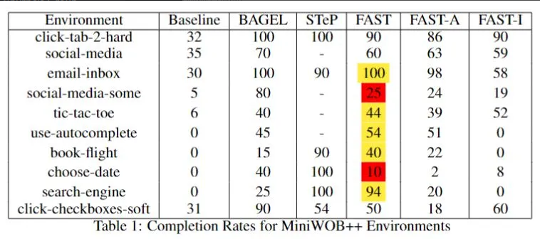

## FAST: Finetuning Agents with Synthetic Trajectories

We propose a method for programmatically defining synthetic trajectories using MiniWOB++ environments, to assemble a dataset for LM finetuning. We require considerably less LM prompting than BAGEL for creating synthetic trajectories and by combining sub-tasks from several environments, we obtain a combinatorial effect similar to STeP. Our fine-tuned model achieves similar performance to STep and BAGEL on MiniWOB++, and has potential for generalizing to other environments.

### Results

[Link to Paper](https://web.stanford.edu/class/cs224n/final-reports/256984105.pdf)
